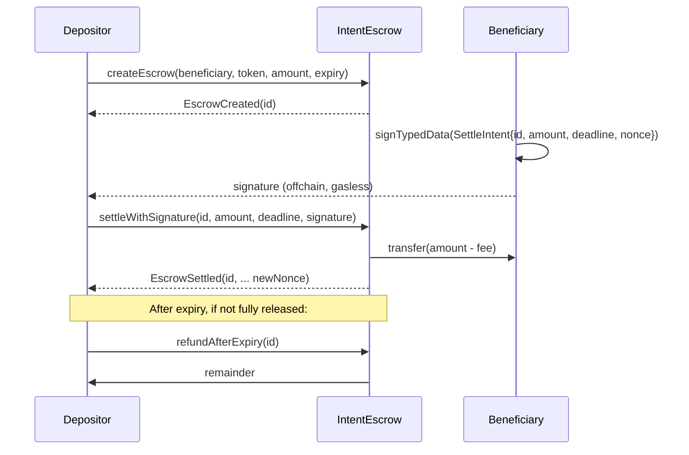

# Intent Escrow

> A minimal, production-quality on-chain escrow where the counterparty authorises releases off-chain by signing an **EIP-712** intent. No gas for the signer, partial releases, expiry refunds, ETH and ERC-20 support — in one audited-pattern Solidity contract and a polished Next.js 15 + wagmi v2 frontend.

---

## Why this is interesting

Account abstraction and the "intents" model are the two biggest shifts in Ethereum UX. This project is a small, self-contained example of both ideas working together:

- The counterparty (beneficiary) **never submits a transaction**. They sign a typed `SettleIntent` off-chain; anyone — the depositor, a relayer, a solver network — can submit it.
- **Smart-wallet beneficiaries work out of the box.** Signature verification uses OpenZeppelin's `SignatureChecker`, which dispatches to ECDSA for EOAs and to **ERC-1271 `isValidSignature`** for contract wallets. That means a Safe, an ERC-4337 account, or an EIP-7702 delegated EOA can all be beneficiaries with zero contract changes — this is what actually makes the design account-abstraction-compatible, not just AA-adjacent.
- Signatures are bound to **domain + chainId + contract + per-escrow nonce + deadline**, so the same replay-safety tricks used by Uniswap `permit`, 0x, Seaport, and ERC-2612 work here verbatim.
- Partial settlements let the depositor drip-release milestones against sequential signed intents — the foundation for things like streaming payroll, bounty payouts, and solver-backed marketplaces.
- The contract is tiny (under ~300 lines excluding comments), auditable in one sitting, and demonstrates the non-negotiable patterns: Checks-Effects-Interactions, `nonReentrant`, `SafeERC20`, zero-address checks, no infinite approvals, **fee-on-transfer-token-safe accounting**, owner-only surplus rescue that provably cannot touch user funds.

It is intentionally **not** a protocol — it's a portfolio-scale artifact that shows the exact toolchain, security patterns, and product thinking required to ship a real one.

---

## Technical stack

| Layer | Choice |
|-------|--------|
| Contracts | Solidity ^0.8.28, OpenZeppelin v5.1.0 (`ReentrancyGuard`, `EIP712`, `SignatureChecker`, `Ownable`, `SafeERC20`) |
| Tooling | Foundry (`forge`, `cast`, `forge-std` v1.9.7, fuzz + invariant + gas snapshots) |
| Network | Sepolia testnet |
| Frontend | Next.js 15 (app router), React 19, wagmi v2, viem 2, TanStack Query, Tailwind |

---

## Architecture



EIP-712 typed data the beneficiary signs:

```
domain   = { name: "IntentEscrow", version: "1", chainId, verifyingContract }
struct   = SettleIntent(uint256 escrowId, uint256 amount, uint256 deadline, uint256 nonce)
```

The contract increments `nonce` atomically on every successful settle, so pre-signed intents for the prior nonce become invalid immediately. Combined with `deadline` and the EIP-712 domain, a signature cannot be replayed across contracts, chains, or time.

---

## Repository layout

```
intent-escrow/
  contracts/            # Foundry project
    src/IntentEscrow.sol
    test/IntentEscrow.t.sol            # 36 unit/signature/fuzz tests
    test/IntentEscrow.invariant.t.sol  # handler-based invariants
    test/mocks/                        # MockERC20, FeeOnTransferERC20,
                                       #   MockERC1271Wallet, Reenterer
    script/Deploy.s.sol
    script/DeployMockToken.s.sol
    .gas-snapshot
  frontend/             # Next.js 15 app-router UI
    app/                # /, /create, /escrows, /escrow/[id]
    components/         # Connect, Create, Card, Sign, Settle, AddressTag
    lib/                # wagmi config, ABIs, typed-data helpers, error parser
  README.md
```

---

## Quickstart (local)

### Prerequisites

- [Foundry](https://book.getfoundry.sh/) (`curl -L https://foundry.paradigm.xyz | bash && foundryup`)
- Node 20+ and npm
- A Sepolia wallet (MetaMask etc.) with a bit of test ETH ([sepoliafaucet.com](https://www.sepoliafaucet.com))

### 1. Contracts

On a fresh clone the vendored libraries aren't checked in — install them via Foundry:

```bash
cd contracts
forge install foundry-rs/forge-std@v1.9.7 OpenZeppelin/openzeppelin-contracts@v5.1.0 --no-commit

forge build
forge test -vv          # 39 tests, ~0.7s
forge snapshot          # regenerates .gas-snapshot
```

Expected output:

```
Ran 2 test suites: 39 tests passed, 0 failed, 0 skipped (39 total tests)
```

### 2. Frontend

```bash
cd frontend
cp .env.local.example .env.local    # fill NEXT_PUBLIC_INTENT_ESCROW_ADDRESS once deployed
npm install
npm run dev                         # http://localhost:3000
```

---

## Deploying to Sepolia

```bash
cd contracts
cp .env.example .env                # fill SEPOLIA_RPC_URL, PRIVATE_KEY, ETHERSCAN_API_KEY
source .env

# Deploy + verify the escrow
forge script script/Deploy.s.sol:Deploy \
  --rpc-url $SEPOLIA_RPC_URL \
  --broadcast \
  --verify \
  --etherscan-api-key $ETHERSCAN_API_KEY

# (Optional) Deploy a demo ERC-20 so you can escrow something other than ETH
forge script script/DeployMockToken.s.sol:DeployMockToken \
  --rpc-url $SEPOLIA_RPC_URL --broadcast
```

Then paste the printed address into `frontend/.env.local` as `NEXT_PUBLIC_INTENT_ESCROW_ADDRESS`, and into the "Live deployment" section below.

> Security note: in production you would transfer ownership to a Gnosis Safe with `escrow.transferOwnership(<safe-address>)` — a single EOA owner is a censorship/fee-rug vector. The fee is hard-capped at 1% in the contract regardless.

---

## End-to-end walk-through

1. **Depositor** opens `/create`, picks ETH or an ERC-20, enters beneficiary + amount + expiry, then (ERC-20 only) approves the **exact** amount and creates the escrow. Wallet pops up twice.
2. **Beneficiary** (a second wallet) opens `/escrow/<id>`, chooses how much to release + a deadline, clicks **Sign intent (gasless)**. Wallet pops up but only for signing — no tx is sent. A JSON payload is shown.
3. **Beneficiary** copies the payload and sends it to the depositor (any channel).
4. **Depositor** pastes the payload into the "Settle with signature" card on the same page and submits. Funds (minus any fee) move to the beneficiary; the nonce bumps to N+1.
5. Repeat steps 2–4 for a partial release, or wait past the expiry and click **Refund** to reclaim the remainder.

---

## Key learnings demonstrated

- **EIP-712 typed data done right**: `name + version + chainId + verifyingContract` domain, a per-struct nonce, and a deadline — the exact pattern used by ERC-2612 `permit` and production marketplaces. Negative tests cover wrong chainId, replayed nonce, expired deadline, and wrong signer.
- **Real account-abstraction support via ERC-1271**: verification uses `SignatureChecker.isValidSignatureNow`, so beneficiaries can be plain EOAs *or* any contract wallet (Safe, ERC-4337 smart account, EIP-7702 delegated EOA). Covered by a dedicated `MockERC1271Wallet` test including the reject-path.
- **Fee-on-transfer / rebasing ERC-20 safety**: `createEscrow` measures the delta of `balanceOf(address(this))` before and after the pull, and stores that as `totalAmount`. The invariant `balance(token) >= totalLocked[token]` holds even for quirky tokens that burn on transfer — proven by a `FeeOnTransferERC20` mock with 5% burn.
- **CEI + defense in depth**: every fund-moving function updates state before `call`/`safeTransfer`, and every fund-moving function also wears `nonReentrant` as a belt-and-braces guard. Proven by a malicious `Reenterer` mock.
- **Owner-safe rescue pattern**: the owner can only withdraw the surplus above `totalLocked[token]`. Even a compromised owner cannot touch user escrows. The fee is hard-capped at `MAX_FEE_BPS = 100` (1%) as an additional immutable bound.
- **Testing depth**: 36 unit/signature/fuzz tests + 3 invariants over 7,680 random call sequences each. Invariants assert `contract_balance(token) >= totalLocked[token]` and `released <= total` hold after every sequence.
- **Real Foundry polish**: gas snapshot committed (`.gas-snapshot`), fuzz runs pinned in `foundry.toml`, custom errors instead of revert strings (cheaper + easier to test against).
- **Frontend UX that matches the contract**: single primary CTA at a time (Connect → Switch network → Approve exact → Execute), a proper two-stage approval state machine (`approving` + `approveCooldown`) so the Create button can't re-enable during the confirm-to-cache-refresh gap, custom-error parsing from viem `BaseError`, copyable addresses with block-explorer deep links, no infinite approvals, human-readable amounts via `formatUnits` / `parseUnits`.

---

## Gas snapshot (excerpt)

```
test_CreateEscrow_Eth_Succeeds()                   175,979
test_CreateEscrow_Erc20_Succeeds()                 221,606
test_Settle_FullEth_PaysBeneficiary()              224,144
test_Settle_FullErc20_PaysBeneficiary()            243,979
test_Settle_PartialReleases_MultipleRounds()       271,409  (3 rounds)
test_Refund_AfterExpiry_ReturnsRemainder()         234,976
```

Full file: [`contracts/.gas-snapshot`](contracts/.gas-snapshot).

---

## Live deployment

| | Link |
|--|--|
| Contract (Sepolia) | `TODO: paste Etherscan URL after first deploy` |
| Frontend (Vercel)  | `TODO: paste Vercel URL after first deploy` |

---

## Security checklist (applied)

Sourced from [ethskills.com/security](https://ethskills.com/security/SKILL.md) and [ethskills.com/audit](https://ethskills.com/audit/SKILL.md):

- [x] Checks-Effects-Interactions in every fund-moving function
- [x] `nonReentrant` on every fund-moving function
- [x] `SafeERC20` for all token calls (USDT/non-standard safe)
- [x] **Fee-on-transfer / rebasing token safe**: `createEscrow` records the actual received amount, not the caller-supplied amount
- [x] **ERC-1271 smart-wallet safe**: signature verification via `SignatureChecker`, not bare `ECDSA.recover`
- [x] Zero-address / zero-amount / expiry-in-future / expiry-too-far validation
- [x] No infinite approvals (frontend approves exact amount)
- [x] No spot-price oracle, no delegatecall, no selfdestruct, no `Pausable` kill-switch (censorship-resistance / CROPS)
- [x] EIP-712 with domain + per-escrow nonce + deadline — replay-safe across time/chain/contract
- [x] Owner rescue bounded by `totalLocked` — cannot touch user funds
- [x] Protocol fee immutable-bounded to 1% via `MAX_FEE_BPS`
- [x] Custom errors + full negative test coverage
- [x] Fuzz + invariant tests (7,680 calls per invariant, 0 reverts)
- [x] Reentrancy-attack mock test covering the `_payout` path
- [ ] Slither run (recommended before mainnet — `pipx install slither-analyzer && slither contracts`)
- [ ] Full 20-skill audit pipeline (recommended before mainnet — see [evm-audit-skills](https://github.com/austintgriffith/evm-audit-skills))

---

## License

MIT.
